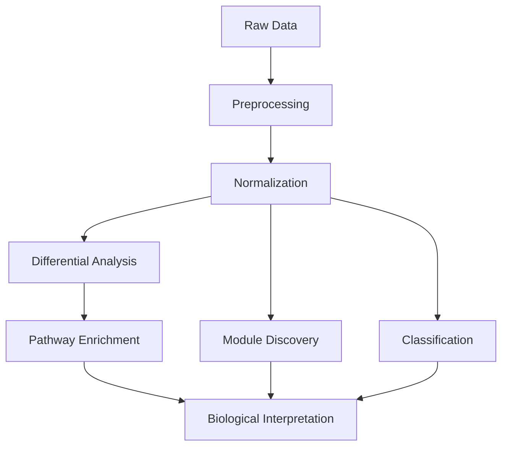

# Proteomics Analysis Pipeline

[](https://www.r-project.org/)
[](LICENSE)

> A R pipeline for proteomics data analysis from preprocessing to biological interpretation

## Overview

This repository provides a comprehensive, end-to-end pipeline for proteomics data analysis. From raw intensity data to biological interpretation, this pipeline implements proteomics data processing, statistical analysis, and functional interpretation.

### What This Pipeline Does

```
Raw Data → Preprocessing → Normalization → Differential Analysis → Pathway Enrichment → Module Discovery → Classification
```

### Key Capabilities

- **Data Preprocessing**: Robust filtering and quality control
- **Statistical Analysis**: Differential abundance testing with multiple testing correction
- **Biological Interpretation**: Pathway enrichment and functional analysis
- **Machine Learning**: Module discovery (NMF) and classification (PLS-DA)


## Quick Start

### Prerequisites

- **R** (version 4.0 or higher)
- **RStudio** (recommended)
- **Git**

### Basic Usage

1. **Prepare your data**:
   ```r
   # Place your Excel file in data/ directory
   # Format: Raw_Intensity and SampleInfo sheets
   ```

2. **Run the complete pipeline**:
   ```r
   # Preprocessing
   source("00_PreprocessData.R")
   
   # Normalization
   source("01_DataNormalization.R")
   
   # Differential analysis
   source("02_DifferentialTesting.R")
   
   # Pathway enrichment
   source("03_PathwayEnrichment.R")
   
   # Module discovery
   source("04_NMF.R")
   
   # Classification
   source("05_PLSDA.R")
   ```

3. **Access results**:
   ```r
   # All results are saved in results/ directory
   # R objects available in workspace
   ```

## Installation

### System Requirements

- **R**: 4.0 or higher
- **Memory**: 8GB RAM (16GB recommended for large datasets)
- **Storage**: 2GB free space
- **Operating System**: Windows, macOS, or Linux

### Dependencies

The pipeline requires the following R packages:

```r
# Core packages
install.packages(c(
  "readxl",      # Excel file reading
  "limma",       # Differential analysis
  "vsn",         # Variance stabilization
  "tidyverse",   # Data manipulation
  "pheatmap",    # Heatmap visualization
  "factoextra",  # PCA analysis
  "mixOmics",    # PLS-DA analysis
  "clusterProfiler", # GO enrichment
  "org.Hs.eg.db",   # Human annotation
  "NMF",         # Non-negative matrix factorization
  "ggplot2",     # Plotting
  "dplyr",       # Data manipulation
  "patchwork"    # Plot arrangement
))
```

### Data Format

The pipeline expects an Excel file with the following structure:

```
Raw_Proteomics.xlsx
├── Raw_Intensity
│   ├── Gene (protein identifiers)
│   ├── Sample1 (intensity values)
│   ├── Sample2 (intensity values)
│   └── ...
└── SampleInfo
    ├── SampleID (matching column names)
    ├── Group (experimental conditions)
    └── Additional metadata
```

## Usage

### Configuration

Each pipeline includes a comprehensive configuration system:

```r
# Example configuration
config <- list(
  # Input/Output paths
  input_file = "data/Raw_Proteomics.xlsx",
  output_dir = "results/",
  
  # Analysis parameters
  gene_missing_threshold = 0.20,    # 20% missing threshold
  sample_missing_threshold = 0.50,  # 50% missing threshold
  pvalue_cutoff = 0.05,            # Statistical significance
  fdr_cutoff = 0.05,               # False discovery rate
  
  # Visualization
  plot_width = 12,
  plot_height = 10,
  dpi = 300,
  
  # Reproducibility
  seed = 123
)
```

### Individual Pipelines

#### 1. Data Preprocessing (`00_PreprocessData.R`)
```r
# Clean and validate raw proteomics data
source("00_PreprocessData.R")
# Output: mat_clean, sample_anno, quality metrics
```

#### 2. Data Normalization (`01_DataNormalization.R`)
```r
# Normalize and scale data for analysis
source("01_DataNormalization.R")
# Output: mat_scaled, normalization plots, outlier detection
```

#### 3. Differential Analysis (`02_DifferentialTesting.R`)
```r
# Identify differentially abundant proteins
source("02_DifferentialTesting.R")
# Output: de_res, volcano plots, statistical summaries
```

#### 4. Pathway Enrichment (`03_PathwayEnrichment.R`)
```r
# Biological interpretation of results
source("03_PathwayEnrichment.R")
# Output: ego_up, ego_down, gsea_res, enrichment plots
```

#### 5. Module Discovery (`04_NMF.R`)
```r
# Unsupervised module discovery
source("04_NMF.R")
# Output: nmf_res, W, H, module_assign, module plots
```

#### 6. Classification (`05_PLSDA.R`)
```r
# Supervised classification analysis
source("05_PLSDA.R")
# Output: plsda_res, vip_scores, classification plots
```

## Pipeline Overview



### Pipeline Details

| Pipeline | Purpose | Key Outputs | Dependencies |
|----------|---------|-------------|--------------|
| **Preprocessing** | Data cleaning and validation | `mat_clean`, quality metrics | `readxl`, `tidyverse` |
| **Normalization** | Variance stabilization and scaling | `mat_scaled`, PCA plots | `vsn`, `factoextra` |
| **Differential** | Statistical analysis | `de_res`, volcano plots | `limma`, `ggplot2` |
| **Enrichment** | Biological interpretation | `ego_up`, `ego_down`, `gsea_res` | `clusterProfiler` |
| **NMF** | Module discovery | `nmf_res`, `W`, `H` | `NMF`, `pheatmap` |
| **PLS-DA** | Classification | `plsda_res`, `vip_scores` | `mixOmics` |

## Output

### Main Results

After running the complete pipeline, you'll have:

- **Preprocessed data**: `mat_clean` (cleaned intensity matrix)
- **Normalized data**: `mat_scaled` (normalized and scaled matrix)
- **Differential results**: `de_res` (differential abundance results)
- **Enrichment results**: `ego_up`, `ego_down`, `gsea_res` (pathway analysis)
- **Module results**: `nmf_res`, `W`, `H`, `module_assign` (module discovery)
- **Classification results**: `plsda_res`, `splsda_res`, `vip_scores` (classification)

### File Structure

```
results/
├── preprocessing/
│   ├── preprocessed_data.RData
│   ├── quality_metrics.csv
│   └── preprocessing_summary.txt
├── normalization/
│   ├── normalized_data.RData
│   ├── pca_plots.pdf
│   └── normalization_summary.txt
├── differential/
│   ├── differential_results.RData
│   ├── volcano_plots.pdf
│   └── differential_summary.txt
├── pathway/
│   ├── enrichment_results.RData
│   ├── enrichment_plots.pdf
│   └── pathway_summary.txt
├── nmf/
│   ├── nmf_results.RData
│   ├── module_plots.pdf
│   └── nmf_summary.txt
└── plsda/
    ├── plsda_results.RData
    ├── classification_plots.pdf
    └── plsda_summary.txt
```

## License

This project is licensed under the MIT License - see the [LICENSE](LICENSE) file for details.

---
